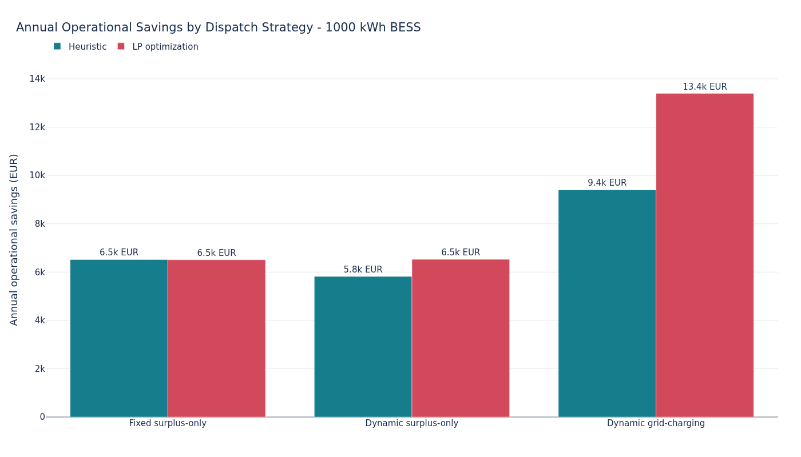

# Smart Building Energy Optimization

This portfolio project builds an end-to-end energy analytics workflow for a
smart company building: source ingestion, PostgreSQL normalization, hourly
energy-balance reconstruction, BESS simulation, and experiment reporting.

Battery dispatch is compared using a transparent heuristic and a 24-hour
rolling-horizon linear program (LP). The project is intended for learning and
technical demonstration, not as production EMS software.

## What This Project Demonstrates

- ingestion and normalization of heterogeneous energy time series
- PostgreSQL schema and analysis-view design
- physically validated battery dispatch simulation
- rule-based control compared with mathematical optimization
- reproducible, parallelized capacity-sensitivity experiments

## Key Results



- The site already self-consumes about `92%` of local PV and CHP generation.
- The best tested `1000 kWh` case saves about `13.4k EUR/year` in simulated
  operating cost.
- In dynamic grid-charging operation, the LP adds about `4.0k EUR/year` over
  the heuristic by scheduling energy for more valuable discharge hours.
- Larger batteries increase total savings and surplus capture, but show
  diminishing marginal value and fewer equivalent cycles per installed kWh.

Savings exclude BESS purchase, installation, financing, maintenance, demand
charges, and replacement costs. Savings are measured against the corresponding
no-battery baseline: fixed-price scenarios use the fixed-price baseline, while
dynamic-price scenarios use the dynamic-price baseline. See the
[full experiment results](docs/bess_experiment_results.md) for capacity
sensitivity, utilization, runtime, feasibility checks, and a 48-hour dispatch
comparison.

## System Overview

```text
Dryad building data + SMARD prices
    -> PostgreSQL measurement schema and analysis views
    -> heuristic / rolling-horizon LP dispatch
    -> physical validation and experiment metrics
```

## Data Sources

The building source is the corrected `reduced_data.zip` version updated on
February 26, 2025. This project uses its hourly electricity measurements for
2021. The local archive size, approximately `320.16 MB`, matches that corrected
Dryad release.

> Engel, Jens; Castellani, Andrea; Wollstadt, Patricia et al. (2025).
> *A real-world energy management data set from a smart company building for
> optimization and machine learning* [Dataset]. Dryad.
> <https://doi.org/10.5061/dryad.73n5tb363>

Dryad datasets are published under CC0; the citation is retained to credit the
dataset authors. German day-ahead electricity prices are sourced from
[SMARD](https://www.smard.de/home), operated by the German Federal Network
Agency.

## Modeling Approach

The experiment compares:

- a no-battery baseline
- fixed-price surplus-only storage
- dynamic-price surplus-only storage
- dynamic-price storage with grid charging
- heuristic and LP dispatch across `250-2000 kWh` capacities

Both controllers use the same physical dispatch contract and validator. The
battery has `95%` charge and discharge efficiency, a `0.03 EUR/kWh` discharged
degradation proxy, and a `500 kW` limit for additional grid charging. Stored
energy can serve local load but cannot be exported.

## Quick Start

Download `reduced_data.zip` from the
[Dryad dataset](https://doi.org/10.5061/dryad.73n5tb363) and place it at
`data/reduced_data.zip`. Then run:

```bash
python3 -m venv .venv
source .venv/bin/activate
python -m pip install -r requirements.txt
cp .env.example .env
docker compose up -d
python scripts/ingest_data.py
python scripts/run_bess_experiments.py
```

The ingestion and experiment settings are editable constants at the top of the
two scripts. Experiment summaries are written to
`results/bess_experiment_results.csv`.

`requirements.txt` contains the runtime dependencies. `requirements-dev.txt`
adds test, notebook, and figure-generation tooling for local development.

To run the offline unit tests, install the development dependencies and run
pytest:

```bash
python -m pip install -r requirements-dev.txt
python -m pytest tests -q
```

The unit tests are offline: they do not require the downloaded source archive,
network access, or PostgreSQL.

## Documentation

| Document | Contents |
|---|---|
| [Experiment results](docs/bess_experiment_results.md) | Findings, charts, capacity sensitivity, runtime, and limitations |
| [Simulation methodology](docs/bess_simulation_methodology.md) | Energy conventions, pricing, battery model, metrics, and validation |
| [Heuristic dispatch](docs/heuristic_dispatch.md) | Rule-based controller and rolling price thresholds |
| [LP optimization](docs/lp_optimization.md) | Objective, constraints, rolling horizon, and modeling choices |

## Limitations

- The LP has perfect foresight inside each rolling horizon.
- The model uses hourly rather than quarter-hour resolution.
- Battery degradation is represented by a simplified throughput cost.
- Forecast uncertainty and real-time command correction are not modeled.
- Reported savings exclude BESS capex and demand charges.
