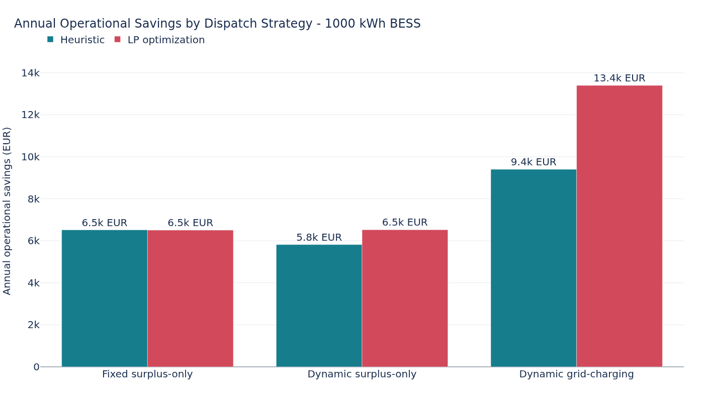
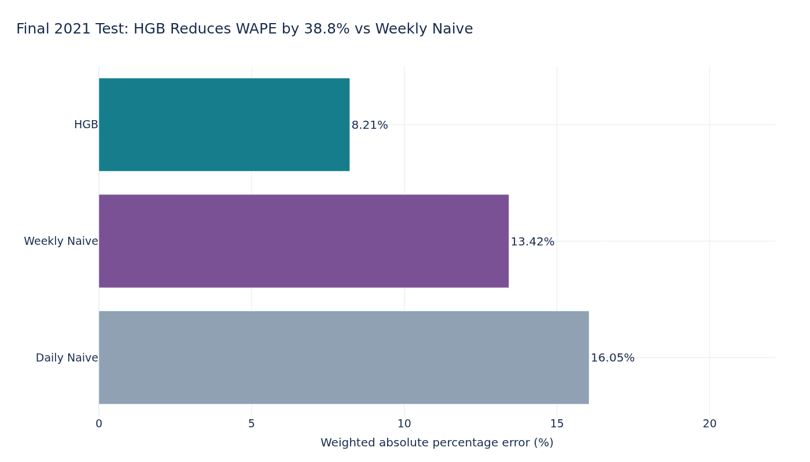

# Smart Building Energy Optimization

This portfolio project builds an end-to-end energy analytics workflow for a
smart company building: source ingestion, PostgreSQL normalization, hourly
energy-balance reconstruction, load forecasting, BESS simulation, and
experiment reporting.

Load forecasting compares seasonal-naive baselines with histogram gradient
boosting under chronological evaluation. Battery dispatch is compared using a
transparent heuristic and a 24-hour rolling-horizon linear program (LP). The
project is intended for learning and technical demonstration, not as
production EMS software.

## What This Project Demonstrates

- ingestion and normalization of heterogeneous energy time series
- PostgreSQL schema and analysis-view design
- leakage-safe 24-hour load forecasting with chronological evaluation
- physically validated battery dispatch simulation
- rule-based control compared with mathematical optimization
- reproducible, parallelized capacity-sensitivity experiments

## Key Results

### Battery Optimization



- The site already self-consumes about `92%` of local PV and CHP generation.
- The best tested `1000 kWh` case saves about `13.4k EUR/year` in simulated
  operating cost.
- In dynamic grid-charging operation, the LP adds about `4.0k EUR/year` over
  the heuristic by scheduling energy for more valuable discharge hours.
- Larger batteries increase total savings and surplus capture, but show
  diminishing marginal value and fewer equivalent cycles per installed kWh.

Savings exclude BESS purchase, installation, financing, maintenance, demand
charges, and replacement costs. Savings are measured against the corresponding
no-battery baseline: fixed-price scenarios use the fixed-price baseline, while
dynamic-price scenarios use the dynamic-price baseline. See the
[full experiment results](docs/battery/experiment_results.md) for capacity
sensitivity, utilization, runtime, feasibility checks, and a 48-hour dispatch
comparison.

### Load Forecasting



The fixed HGB model achieves `8.21%` WAPE on the held-out 2021 test period,
with performance close to its Q4 2020 validation result. Error analysis shows
that summer working hours remain the clearest opportunity for improvement.

See the [load forecast results](docs/forecasting/results.md) for the
chronological evaluation design, model comparison, and error diagnostics.

## System Overview

```text
Dryad building measurements
    -> PostgreSQL normalization and hourly energy reconstruction
       -> load forecasting
          -> chronological validation and frozen 2021 test
       -> battery simulation + SMARD prices
          -> heuristic and rolling-horizon LP dispatch
          -> physical validation and experiment metrics
```

## Data Sources

The building source is the corrected `reduced_data.zip` version updated on
February 26, 2025. Load forecasting uses hourly electricity measurements from
June 2019 through 2021; the BESS experiments use the 2021 measurements. The
local archive size, approximately `320.16 MB`, matches that corrected Dryad
release.

> Engel, Jens; Castellani, Andrea; Wollstadt, Patricia et al. (2025).
> *A real-world energy management data set from a smart company building for
> optimization and machine learning* [Dataset]. Dryad.
> <https://doi.org/10.5061/dryad.73n5tb363>

Dryad datasets are published under CC0; the citation is retained to credit the
dataset authors. German day-ahead electricity prices are sourced from
[SMARD](https://www.smard.de/home), operated by the German Federal Network
Agency.

## Quick Start

Download `reduced_data.zip` from the
[Dryad dataset](https://doi.org/10.5061/dryad.73n5tb363) and place it at
`data/reduced_data.zip`. Then run:

```bash
python3 -m venv .venv
source .venv/bin/activate
python -m pip install -r requirements.txt
cp .env.example .env
docker compose up -d
python scripts/ingest_data.py
```

### Run Battery Experiments

```bash
# Hourly capacity-sensitivity experiment
python scripts/battery/run_capacity_analysis.py

# General BESS simulation (15-minute resolution by default)
python scripts/battery/run_bess_simulation.py

# Compare hourly and 15-minute resolution
python scripts/battery/run_bess_simulation.py --resolutions hour 15min
```

Shared assumptions are defined in `scripts/battery/experiment_defaults.py`.
Configuration options, terminal-value comparisons, and audit exports are
documented in the [BESS LP methodology](docs/battery/lp_optimization.md).

### Run Load Forecasting

```bash
python scripts/forecasting/run_validation.py
python scripts/forecasting/run_final_test.py
```

Both commands write compact CSV summaries to `results/forecasting/`. Pass
`--save-forecasts` only when the large row-level prediction and error table is
needed. The final-test command reproduces the fixed 2021 result.

`requirements.txt` contains the runtime dependencies. `requirements-dev.txt`
adds test, notebook, and figure-generation tooling for local development.

To run the offline unit tests, install the development dependencies and run
pytest:

```bash
python -m pip install -r requirements-dev.txt
python -m pytest tests -q
```

The unit tests are offline: they do not require the downloaded source archive,
network access, or PostgreSQL.

## Documentation

| Document | Contents |
| --- | --- |
| [Battery experiment results](docs/battery/experiment_results.md) | Findings, charts, capacity sensitivity, runtime, and limitations |
| [BESS time-resolution comparison](docs/battery/time_resolution_comparison.md) | Hourly versus 15-minute energy, peaks, and simulated operating value |
| [Battery simulation methodology](docs/battery/simulation_methodology.md) | Energy conventions, pricing, battery model, metrics, and validation |
| [Heuristic dispatch](docs/battery/heuristic_dispatch.md) | Rule-based controller and rolling price thresholds |
| [LP optimization](docs/battery/lp_optimization.md) | Objective, constraints, rolling horizon, and modeling choices |
| [Load forecast results](docs/forecasting/results.md) | Method, validation, final 2021 results, and error diagnostics |

Detailed assumptions, scope boundaries, and limitations are documented with
the corresponding methodology and results.
