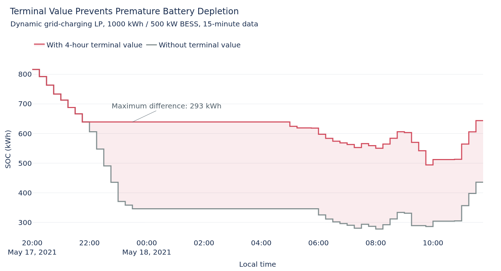

# BESS Terminal-Value Comparison

This experiment isolates the terminal-value treatment in the rolling-horizon
LP. Its purpose is to test whether assigning a value to stored energy beyond
the current planning window produces a more plausible executed dispatch.

## Experiment Setup

Both runs use identical assumptions:

- complete 2021 data at 15-minute resolution
- 1000 kWh capacity and 500 kW charge/discharge power
- dynamic surplus and grid charging
- 24-hour rolling horizon with perfect foresight inside the horizon
- identical SOC limits, efficiencies, degradation cost, prices, and grid limit

The only difference is the horizon treatment. The reference run assigns no
value to terminal SOC. The comparison run values usable terminal SOC from the
time-weighted mean all-in import price over the final four horizon hours.

## Annual Result

Both runs start and finish at the technical minimum of 100 kWh. Their realised
costs therefore have the same annual boundary inventory and can be compared
directly.

| Dynamic grid-charging LP | Without terminal value | With terminal value | Change |
| --- | ---: | ---: | ---: |
| Operational savings | 14,158.94 EUR | 14,189.07 EUR | +30.13 EUR |
| Grid import | 1,188,352.01 kWh | 1,188,175.44 kWh | -176.57 kWh |
| Approximate full cycles | 177.30 | 176.62 | -0.68 |
| Peak grid import | approximately 500 kW | approximately 500 kW | unchanged |

The terminal value changes 541 of 35,040 executed intervals, or 1.54%. Its
annual cost effect is small, but the local dispatch effect can be substantial.

## Dispatch Example

The selected period contains the largest SOC difference in the annual dynamic
grid-charging comparison. Without a terminal value, energy has no value beyond
the active planning horizon and the LP begins discharging earlier. With the
four-hour terminal value, retaining the energy is more valuable at that point;
the battery holds up to 293 kWh more energy for later intervals. The terminal
value is derived from the mean all-in price over hours 20 to 24 of each rolling
horizon, as described in the [LP model](lp_optimization.md#terminal-energy-value).

## Interpretation

The terminal value is not booked as revenue in the reported KPIs. The observed
30.13 EUR improvement is a change in realised operating cost with identical
annual start and end SOC, rather than a fictional terminal credit.

The main result is therefore methodological: terminal valuation removes an
artificial horizon-boundary incentive. It affects relatively few intervals and
does not materially change the annual peak, but it can shift several hundred
kWh of stored energy locally. The small annual cost change also shows why this
feature should be presented as a model correction rather than a new source of
large savings.

The fixed-price case is not used for the headline comparison because its runs
finish with different SOC inventories. Comparing their raw annual costs would
mix dispatch performance with the value of energy remaining in the battery.
