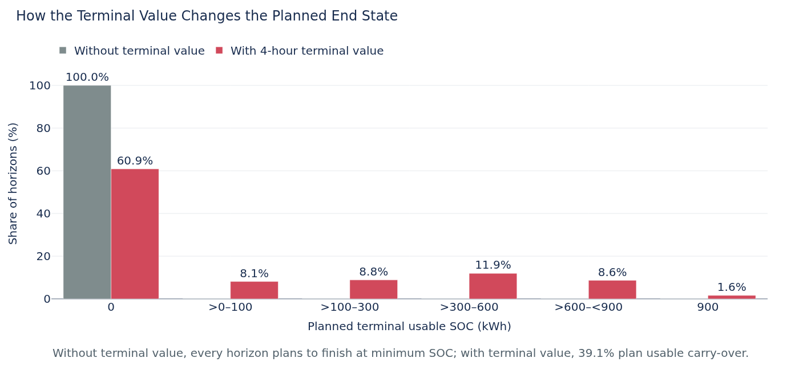

# BESS Terminal-Value Comparison

This experiment isolates whether valuing stored energy at the end of each
rolling horizon changes the planned terminal state and realised annual result.

## Experiment Setup

Both runs use the shared [simulation
methodology](simulation_methodology.md) and the same 2021 15-minute,
`1000 kWh` dynamic grid-charging setup. The only difference is that the
comparison run values usable terminal SOC from the mean all-in import price
over the final four horizon hours; the reference run assigns it no value. The
formula is documented with the [LP objective](lp_optimization.md#terminal-energy-value).

## Annual Result

Both runs start and finish at the technical minimum of 100 kWh. Their realised
costs therefore have the same annual boundary inventory and can be compared
directly.

| Dynamic grid-charging LP | Without terminal value | With terminal value | Change |
| --- | ---: | ---: | ---: |
| Operational savings | 14,112.79 EUR | 14,142.60 EUR | +29.82 EUR |
| Grid import | 1,186,003.73 kWh | 1,185,831.97 kWh | -171.76 kWh |
| Approximate full cycles | 176.54 | 175.77 | -0.76 |
| Peak grid import | approximately 500 kW | approximately 500 kW | unchanged |

Directly executed energy flows change in 802 of 35,040 intervals (2.29%): 441
surplus-charge, 58 grid-charge, and 303 discharge decisions. Executed SOC
differs in 5,342 intervals; either flow or SOC differs in 5,467 (15.60%).

## Planned Horizon End State

The chart reports the planned usable SOC at the end of each horizon, not the
SOC at the currently executed interval. Without terminal value, all 35,040
plans end at the technical minimum. With terminal value, 13,715 plans (39.14%)
carry usable energy beyond it.

## Interpretation

Terminal valuation counteracts the finite-horizon incentive to finish at
minimum SOC, but has little annual financial effect. The `29.82 EUR` improvement
is realised operating cost with identical annual start and end SOC; terminal
credit is not booked as revenue. The unchanged peak and small savings change
make this a model correction, not a new source of material savings.

The fixed-price case is not used for the headline comparison because its runs
finish with different SOC inventories. Comparing their raw annual costs would
mix dispatch performance with the value of energy remaining in the battery.
