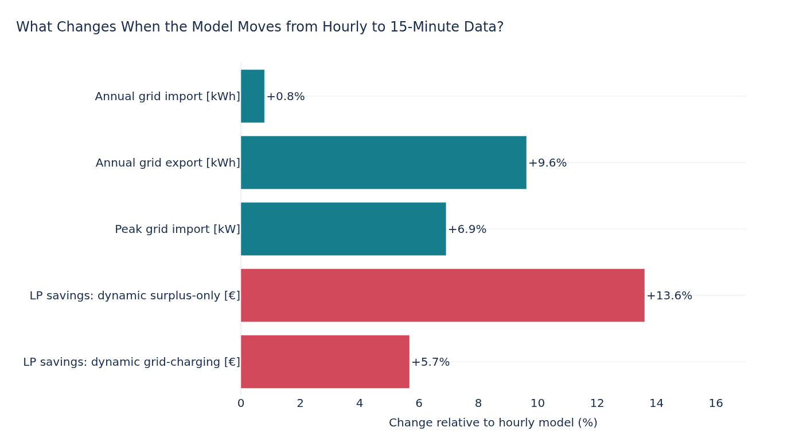
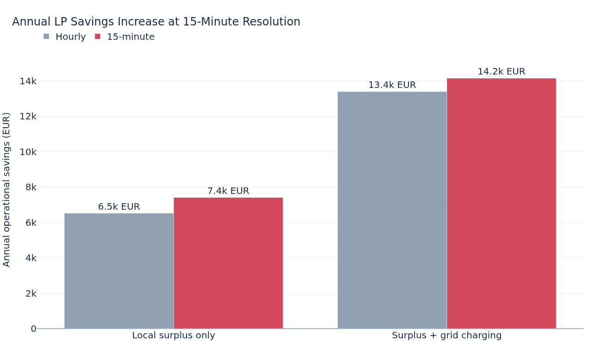
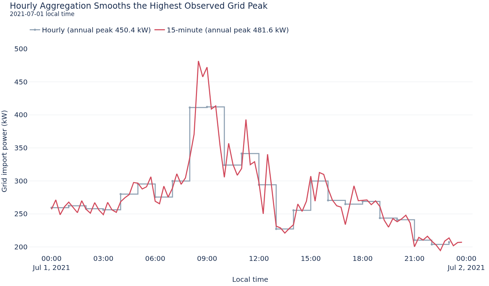

# BESS Time-Resolution Comparison

This experiment isolates the effect of modeling the same electrical system at
hourly and 15-minute resolution. Battery parameters, dispatch strategies,
economic assumptions, and the 24-hour planning horizon remain unchanged.

The central result is that annual energy totals remain similar while grid
peaks, short surplus periods, and simulated BESS value change materially.

## Experiment Setup

| Parameter | Hourly model | 15-minute model |
| --- | ---: | ---: |
| 2021 observations | 8,760 | 35,040 |
| Timestep | 1 h | 0.25 h |
| Rolling horizon | 24 steps | 96 steps |
| Battery energy / power | 1000 kWh / 500 kW | 1000 kWh / 500 kW |
| Charge / discharge efficiency | 95% / 95% | 95% / 95% |

The source provides both measurement resolutions. Hourly day-ahead prices are
assigned to all four 15-minute intervals of the corresponding hour. Dispatch
flows are stored as interval energy in kWh, while all battery and grid power
limits are scaled by the timestep.

## What Changes at 15-Minute Resolution?

| No-BESS baseline | Hourly | 15-minute | Difference |
| --- | ---: | ---: | ---: |
| Annual grid import | 1,242.4 MWh | 1,252.3 MWh | +0.8% |
| Annual grid export | 102.5 MWh | 112.3 MWh | +9.6% |
| Peak grid import | 450.4 kW | 481.6 kW | +6.9% |
| Dynamic net cost | 263.7k EUR | 264.8k EUR | +0.4% |

Annual import changes by less than one percent, but hourly aggregation hides
almost ten percent of exported energy and reduces the observed peak by about
31 kW. Import and export occurring in different quarters of the same hour are
partly netted in the hourly representation.

## Impact on Simulated BESS Value

| Perfect-foresight LP strategy | Hourly savings | 15-minute savings | Difference |
| --- | ---: | ---: | ---: |
| Dynamic surplus-only | 6.5k EUR | 7.4k EUR | +13.6% |
| Dynamic surplus plus grid charging | 13.4k EUR | 14.2k EUR | +5.7% |

For each resolution, savings are measured against the corresponding baseline
without a battery. The final percentage then shows how this calculated saving
changes between the hourly and 15-minute models. Therefore, `+13.6%` and
`+5.7%` mean that the 15-minute model estimates a higher operational BESS
value; they do not represent a direct LP-versus-heuristic comparison.

The comparison does not claim that these values reproduce the site's actual
electricity contract. It shows how the *same* documented economic scenario is
evaluated differently when the physical data retains quarter-hour behavior.

## Why the Peak Changes

`peak_grid_import_kw` is the maximum interval-average grid-import power. The
15-minute model retains shorter peaks that are smoothed by a full-hour
average. It still does not represent instantaneous second-level peaks.

## Interpretation and Limitations

- Hourly data is adequate for a first annual-energy estimate but less reliable
  for peak and dispatch questions.
- The hourly model understates simulated BESS savings by 5.7% to 13.6% in the
  two dynamic LP cases.
- The 500 kW grid limit is a transparent scenario assumption, not a known site
  connection rating.
- No real demand charge or site tariff is reconstructed. Economic results are
  conditional scenario outcomes.
- The LP uses perfect knowledge of the next 24 hours and therefore acts as an
  optimization benchmark rather than a production EMS forecast.
- Battery investment cost and a storage-sizing decision are outside this
  experiment.
