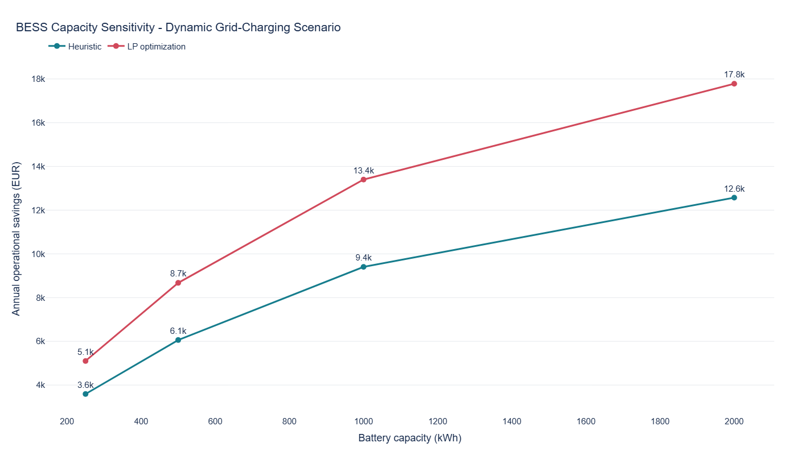
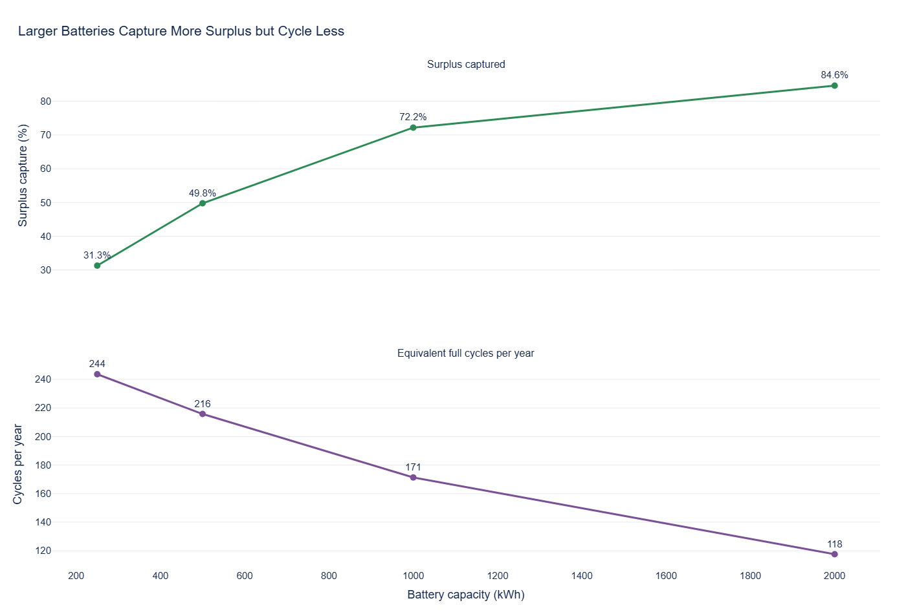
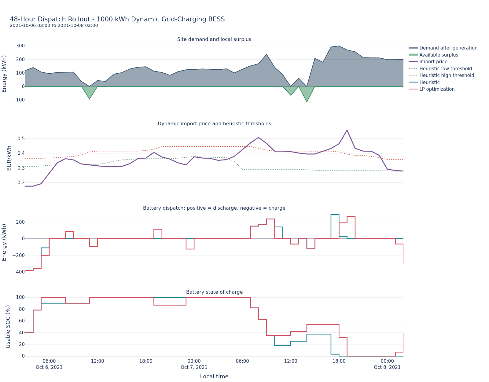

# BESS Experiment Results

This document summarizes the 2021 battery energy storage system (BESS)
experiments. It compares a transparent heuristic controller with a
rolling-horizon linear program (LP), then examines how the results change with
battery capacity.

The physical model and economic assumptions are described in
[`bess_simulation_methodology.md`](bess_simulation_methodology.md). The
controller details are documented in
[`heuristic_dispatch.md`](heuristic_dispatch.md) and
[`lp_optimization.md`](lp_optimization.md).

These results are simulated annual operating outcomes. They are not an
investment recommendation and do not include battery purchase, installation,
financing, maintenance, or replacement costs.

## Experiment Setup

The experiment uses one year of hourly building, local generation, and SMARD
day-ahead price data from 2021.

| Parameter | Value |
|---|---:|
| Battery capacities | 250, 500, 1000, 2000 kWh |
| C-rate | 0.5 |
| Minimum / maximum SOC | 10% / 100% |
| Charge / discharge efficiency | 95% / 95% |
| LP and heuristic horizon | 24 hours |
| Import-price markup | 0.115 EUR/kWh |
| Export price | 0.08 EUR/kWh |
| Degradation proxy | 0.03 EUR/discharged kWh |
| Grid-charging connection limit | 500 kW |

The comparison includes:

- a no-battery baseline
- fixed-price surplus-only dispatch
- dynamic-price surplus-only dispatch
- dynamic-price surplus plus grid-charging dispatch

Savings for the fixed-price scenario use the fixed-price no-battery baseline.
Savings for both dynamic scenarios use the dynamic-price no-battery baseline.

## Baseline Site Characteristics

Before adding a battery, the reconstructed site has:

| Metric | Baseline value |
|---|---:|
| Annual grid import | 1.24 GWh |
| Annual grid export | 102 MWh |
| Peak grid import | 450 kW |
| Local-generation self-consumption | 92.0% |
| Fixed-price annual net cost | 255.0k EUR |
| Dynamic-price annual net cost | 263.7k EUR |

The site already consumes most of its local PV and CHP generation directly.
Only about 8% is exported, so a surplus-only battery starts with a relatively
limited energy pool. This is why grid charging and price timing become
important for additional operating value.

## Strategy Comparison

The `1000 kWh` case provides a representative comparison between dispatch
strategies.

| Method | Scenario | Annual operational savings | Surplus captured | Equivalent cycles | Runtime |
|---|---|---:|---:|---:|---:|
| Heuristic | Fixed surplus-only | 6.5k EUR | 75.6% | 69.9 | 0.6 s |
| LP | Fixed surplus-only | 6.5k EUR | 75.6% | 69.9 | 9.3 min |
| Heuristic | Dynamic surplus-only | 5.8k EUR | 67.5% | 62.4 | 5.3 s |
| LP | Dynamic surplus-only | 6.5k EUR | 74.7% | 69.1 | 9.4 min |
| Heuristic | Dynamic grid-charging | 9.4k EUR | 66.1% | 200.6 | 7.8 s |
| LP | Dynamic grid-charging | 13.4k EUR | 72.2% | 171.3 | 10.0 min |

All savings exclude BESS investment cost.

In fixed surplus-only operation, the heuristic is already effectively optimal:
it stores available surplus and uses it against later demand. The LP produces
almost the same result because there is little economic timing complexity when
every avoided import kWh has the same value. Small differences can remain from
rolling-horizon decisions and horizon-end effects.

Dynamic surplus-only dispatch gives the LP a modest advantage. At `1000 kWh`,
the LP improves annual operating savings by about `0.7k EUR` because it can
reserve stored surplus for more valuable deficit hours.

The largest controller difference appears when grid charging is enabled. The
LP improves annual operating savings by about `4.0k EUR` over the heuristic at
`1000 kWh`. It jointly considers charging cost, future demand, future surplus,
SOC, degradation, efficiency losses, and grid headroom rather than reacting to
price thresholds alone.

## Why The LP Creates More Arbitrage Value

The `1000 kWh` dynamic grid-charging case illustrates that buying at the lowest
average price is not sufficient for good arbitrage.

| Method | Average grid-charge price | Average discharge-hour price | Adjusted spread |
|---|---:|---:|---:|
| Heuristic | 0.185 EUR/kWh | 0.248 EUR/kWh | 0.012 EUR/kWh |
| LP | 0.205 EUR/kWh | 0.282 EUR/kWh | 0.024 EUR/kWh |

The heuristic grid-charges only when the current price falls below the rolling
20th-percentile threshold, so it purchases energy at a lower average price.
However, it discharges whenever the price crosses the rolling 80th-percentile
threshold and usable SOC is available. A locally high price can still be
moderate compared with a more expensive hour later in the horizon.

The LP sometimes accepts a higher charging price because it can see that the
stored energy will displace substantially more expensive imports later. It also
cycles less: about `171` equivalent cycles instead of `201` for the heuristic.
The resulting charge-discharge timing is more selective and produces roughly
twice the efficiency- and degradation-adjusted price spread.

The spread is an explanatory proxy. The dispatch output does not trace whether
each discharged kWh originally came from local surplus or grid charging.

## Capacity Sensitivity

Dynamic grid charging with LP optimization produces the highest annual
operating savings at every tested capacity.

| Capacity | Annual operational savings | Additional savings | Marginal value of added capacity |
|---:|---:|---:|---:|
| 250 kWh | 5.1k EUR | - | - |
| 500 kWh | 8.7k EUR | 3.6k EUR | 14.3 EUR/kWh-year |
| 1000 kWh | 13.4k EUR | 4.7k EUR | 9.4 EUR/kWh-year |
| 2000 kWh | 17.8k EUR | 4.4k EUR | 4.4 EUR/kWh-year |

Total savings continue to increase, but the value of each additional installed
kWh declines sharply. Moving from `1000` to `2000 kWh` adds twice as much
capacity as the previous step while producing less additional annual savings.

The `2000 kWh` result is therefore useful as an upper sensitivity case. It does
not establish that this capacity is economically optimal because the experiment
does not include installed cost, financing, maintenance, replacement, or
project lifetime.

## Battery Utilization

For LP dynamic grid charging, increasing capacity raises the share of local
surplus captured from `31%` at `250 kWh` to `85%` at `2000 kWh`. At the same
time, equivalent annual cycles fall from about `244` to `118`.

This combination explains the diminishing returns:

- small batteries cannot absorb all available surplus, but their installed
  capacity is used frequently
- larger batteries capture more surplus and provide more scheduling freedom
- the additional capacity spends more time unused and cycles less often

The reported `soc_range_utilization` is `1.0` for every tested BESS run because
each battery reaches both ends of its usable SOC range at least once during the
year. That confirms full range access, but it is not a useful measure of how
intensively the battery is used. Equivalent cycles, throughput, and surplus
capture are more informative annual utilization metrics.

## 48-Hour Dispatch Example

The rollout shows the `1000 kWh` dynamic grid-charging case from October 6,
2021 at 03:00 through October 8, 2021 at 02:00. The displayed window was
selected reproducibly: candidate periods had to contain meaningful surplus,
demand, grid charging, and battery discharge for both controllers, then were
ranked by their 48-hour price range.

The panels show:

1. remaining site demand above zero and available local surplus below zero
2. dynamic import price with the heuristic's rolling low/high thresholds
3. battery dispatch, where positive values are discharge and negative values
   are charging
4. usable battery SOC, normalized between the configured minimum and maximum

The heuristic reacts when prices cross its percentile thresholds. It can
therefore discharge at a price that is high relative to the current window but
still lower than a later price spike. The LP evaluates the economic value of
the complete horizon, so it can preserve energy for more valuable hours or
charge outside the heuristic's strict low-price classification when that
improves total horizon cost.

The chart is an explanatory example, not the basis of the annual conclusion.
Annual metrics aggregate all 8,760 simulated hours.

## Runtime Tradeoff

The heuristic completes a full annual scenario in approximately `0.6-7.8`
seconds, depending on whether price thresholds and future-surplus calculations
are required.

The LP takes approximately `9.3-10.0` minutes per annual capacity/scenario run.
The model itself is small, but rolling hourly control builds and solves a new LP
for every one of the 8,760 simulation hours. Parallel experiment execution
reduces total wall-clock time across independent runs, but it does not reduce
the computational cost of an individual annual LP simulation.

This is an important engineering tradeoff: the LP provides a useful optimality
benchmark and better dynamic scheduling, while the heuristic is much cheaper
to execute and easier to explain.

## Feasibility Checks

Both controller implementations pass the same physical dispatch validator.
The generated experiment results therefore satisfy the modeled constraints:

- charge, discharge, grid-import, and grid-export flows are nonnegative
- SOC remains inside the configured minimum and maximum
- charge and discharge power limits are respected
- charging never exceeds available surplus or connection headroom
- discharge never exceeds remaining local demand
- no simultaneous charging and discharging appears in the final dispatch
- hourly energy and SOC balances remain consistent

The dynamic grid-charging cases also respect the `500 kW` limit for additional
grid charging within solver tolerance. This limit does not curtail natural
building demand and is not a complete point-of-connection model.

## Limitations

- The LP uses perfect foresight inside each rolling horizon.
- The simulation uses hourly resolution and does not model quarter-hour peaks.
- Battery degradation is represented by a simple discharged-throughput cost.
- Battery capex, financing, maintenance, replacement, and payback are excluded.
- Demand charges and an explicit peak-shaving objective are excluded.
- Forecast error and real-time command correction are excluded.
- Stored battery energy cannot be exported to the grid.
- The grid limit constrains extra battery charging, not all import/export flows.
- The LP has no terminal value function and can retain horizon-end effects.

## Main Conclusions

1. The site already self-consumes about `92%` of local generation, limiting the
   opportunity for surplus-only storage.
2. A simple heuristic is sufficient for fixed-price surplus-only dispatch; LP
   optimization adds little value in that case.
3. LP optimization is most valuable when grid charging and dynamic prices add
   real intertemporal tradeoffs.
4. Larger batteries increase savings and surplus capture, but utilization and
   marginal value decline with capacity.
5. The `1000 kWh` LP grid-charging case offers a strong operational result in
   this comparison, but economic sizing requires investment and lifetime-cost
   assumptions that are outside this experiment.
