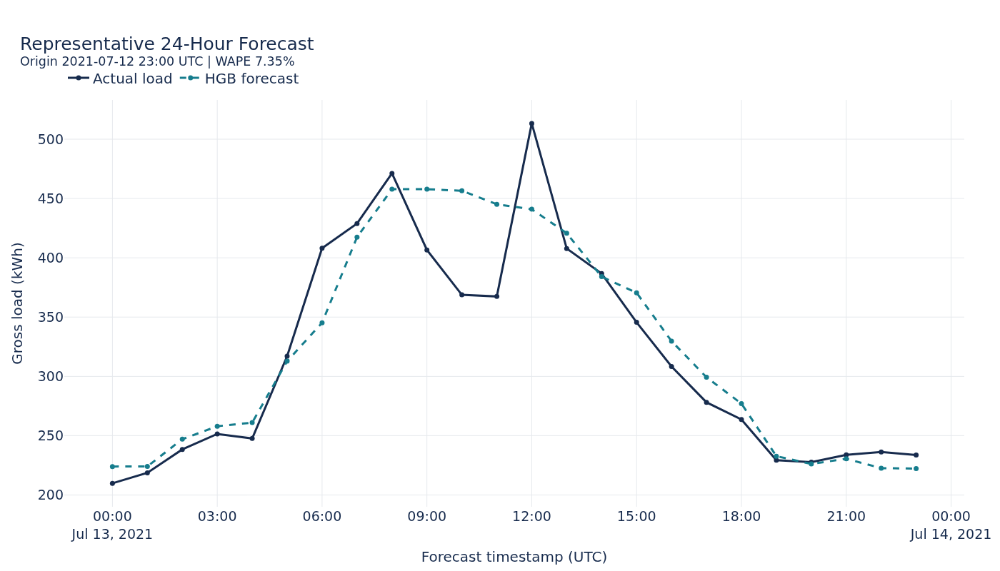
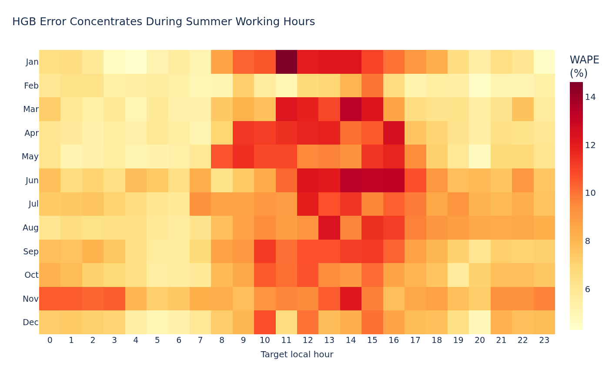
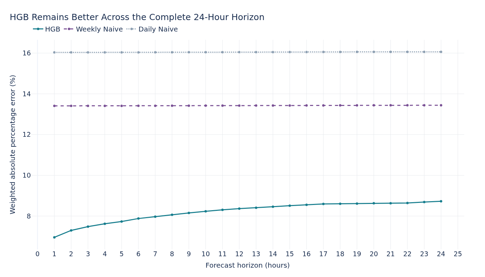

# Load Forecast Results

This document records the chronological validation and final 2021 test of the
hourly gross-load forecasting workflow. It compares two seasonal-naive
baselines with a histogram gradient boosting (HGB) model over a rolling
24-hour horizon.

## Forecasting Task

The target is reconstructed hourly building gross load. At every eligible
forecast origin, each model produces one prediction for every horizon from one
through 24 hours ahead.

Daily Naive uses the load observed 24 hours before each target timestamp.
Weekly Naive uses the load observed 168 hours before it. The HGB model combines
the forecast horizon with leakage-safe information available at the origin:

- target-calendar hour, weekday, weekend, month, holiday, bridge-day, and
  Christmas-shutdown indicators
- load at the origin and at one-hour, daily, and weekly lags
- rolling 24-hour and 168-hour load statistics
- load at the same target hour on the previous day and previous week

The fixed HGB configuration uses a `0.05` learning rate, `300` boosting
iterations, `15` maximum leaf nodes, `20` minimum samples per leaf, and `1.0`
L2 regularization. The reported model retains this fixed default configuration.

## Chronological Evaluation

Model development and final testing use adjacent, non-overlapping UTC splits:

| Stage | Training data | Evaluation period | Purpose |
| --- | --- | --- | --- |
| Validation | 28 June 2019 to 30 September 2020 | Q4 2020 | Fix the workflow and model choice |
| Final test | 28 June 2019 to 31 December 2020 | 2021 | One-time generalization estimate |

The training period starts at the first timestamp with complete PV, CHP, and
total-load coverage. The HGB model is fitted once per stage. During evaluation,
forecasts roll forward hourly and may use actual load observed through the
current origin; they never use observations after that origin as features.

The Q4 validation contains `2,184` origins and `52,416` origin-horizon rows per
model. The final test contains `8,735` origins and `209,640` rows per model.
Because the horizons overlap, these are forecast instances rather than the
same number of independent target timestamps.

## Validation Results

| Model | MAE | RMSE | Bias | WAPE |
| --- | ---: | ---: | ---: | ---: |
| HGB | **22.10 kWh** | **32.03 kWh** | **-0.05 kWh** | **7.91%** |
| Weekly Naive | 36.81 kWh | 49.64 kWh | +6.47 kWh | 13.17% |
| Daily Naive | 42.10 kWh | 67.35 kWh | +1.66 kWh | 15.06% |

The HGB model provides the strongest validation result and removes the
material positive bias of Weekly Naive. The model configuration and feature
set were frozen before the 2021 test was evaluated.

## Final 2021 Test Results

| Model | MAE | RMSE | Bias | WAPE |
| --- | ---: | ---: | ---: | ---: |
| HGB | **22.67 kWh** | **33.49 kWh** | +1.99 kWh | **8.21%** |
| Weekly Naive | 37.05 kWh | 52.08 kWh | +0.27 kWh | 13.42% |
| Daily Naive | 44.29 kWh | 70.39 kWh | +0.01 kWh | 16.05% |

On the final test, HGB reduces both MAE and WAPE by `38.82%` relative to Weekly
Naive and by `48.83%` relative to Daily Naive. Its MAE is only `2.6%` higher
than in Q4 validation, while WAPE moves from `7.91%` to `8.21%`. The similar
validation and test results support generalization beyond the original
validation season.

The positive HGB test bias of `1.99 kWh` indicates mild average overprediction,
but it remains small relative to both the typical load and absolute forecast
error.

## Error Diagnostics

### Representative Forecast

The displayed origin is selected reproducibly as the 24-hour HGB forecast
whose aggregated WAPE is closest to the median origin WAPE. Its `7.35%` WAPE is
therefore a representative example rather than a hand-picked best case.

### Month

HGB outperforms both seasonal baselines in every test month. Its lowest monthly
WAPE is `6.02%` in February, followed by `7.54%` in December. Its highest
monthly WAPE occurs in June (`9.22%`) and November (`9.06%`).

| Month | HGB WAPE |
| --- | ---: |
| January | 8.34% |
| February | 6.02% |
| March | 7.88% |
| April | 8.09% |
| May | 8.03% |
| June | 9.22% |
| July | 8.82% |
| August | 8.55% |
| September | 8.61% |
| October | 8.08% |
| November | 9.06% |
| December | 7.54% |

### Local Hour

The HGB error is lowest around 06:00 at `5.75%` WAPE and rises during working
hours. It reaches `10.57%` at 12:00 and peaks at `10.91%` at 15:00. The model
substantially improves on both baselines during these hours, but the remaining
afternoon pattern is the clearest opportunity for additional explanatory
features.

### Forecast Horizon

HGB WAPE increases gradually from `6.96%` at one hour ahead to `8.73%` at 24
hours ahead. This expected degradation remains well below Weekly Naive
(`13.41-13.44%`) and Daily Naive (`16.03-16.06%`) throughout the horizon.

## Scope and Limitations

- The model produces point forecasts without prediction intervals.
- Weather, temperature, occupancy, and production schedules are not available
  as model features.
- Rolling evaluation assumes the actual load through each forecast origin is
  available; the model is not predicting the complete year in one operation.
- Metrics aggregate overlapping origin-horizon forecasts, so adjacent rows are
  not statistically independent.
- The available UTC test data ends at `2021-12-31 22:00`, giving `8,759` raw
  test observations and `8,735` complete 24-hour origins.
- One flagged gross-load observation was interpolated in April 2020 during
  training. No test target was imputed.
- Further development based on the revealed 2021 errors requires a new
  validation or holdout strategy rather than repeated selection on this test.

The summer-afternoon error pattern suggests temperature as the most promising
next feature, but that hypothesis was not tested in the reported result.
